===================================
Modalità: il processo di onboarding
===================================

La fase di onboarding costituisce il prerequisito che consente agli
Erogatori di servizi (sia pubblici che privati) di aderire allo schema
di identificazione «Entra con CIE».

Tale fase è gestita in modalità completamente digitale sul `Portale
Federazione Entra con CIE <https://federazione.servizicie.interno.gov.it/>`__\  [1]_ , messo a
disposizione dal Ministero dell’Intero - in qualità di Identity Provider
(IdP) - e gestito e sviluppato dall’Istituto Poligrafico e Zecca dello
Stato (Poligrafico) che, in qualità di *partner* *tecnologico*, ne cura
tutti gli aspetti tecnici.

In particolare, il portale consente agli Erogatori di Servizi di:

-  Effettuare facilmente la richiesta di adesione

-  Scegliere il protocollo di federazione (SAML oppure OIDC) e ricevere
   l’esito della federazione

-  Verificare in ogni istante lo stato delle attività.

I principali vantaggi che derivano dall’utilizzo del portale di
federazione sono:

-  gestione e controllo dell’intero ciclo di vita: federazione,
   sviluppo, test, produzione, esercizio e conduzione operativa

-  snellimento delle procedure amministrative e tecniche di onboarding

-  processo di federazione e configurazione più efficiente

Un erogatore di servizi può aderire allo schema di identificazione
«Entra con CIE» con una o più delle seguenti finalità operative:

1. **Fornitore di Servizi**: soggetto privato o Pubblica Amministrazione
   che adotta lo schema “Entra con CIE” per identificare i cittadini ai
   quali fornisce i propri servizi digitali

2. **Soggetto Aggregatore**: soggetto privato o Pubblica Amministrazione
   che offre a terzi (soggetti aggregati) la possibilità di rendere
   accessibili i rispettivi servizi tramite lo schema “Entra con CIE”

3. **Gestore di Servizio Pubblico**: soggetto privato che adotta lo
   schema “Entra con CIE” per identificare i cittadini ai quali fornisce
   i servizi digitali per conto della Pubblica Amministrazione. Il
   gestore deve essere dotato di un codice IPA.

Gli attori del processo 
=======================

Sono identificati di seguito gli attori del processo di federazione
richiamato dal portale:

1. **Referente amministrativo**: è il soggetto, designato
   dall’organizzazione che intende aderire allo schema di
   identificazione «Entra con CIE», che cura gli aspetti amministrativi
   della richiesta di adesione sul portale

2. **Soggetto con poteri di firma**: è il soggetto dell’organizzazione
   che intende aderire allo schema di identificazione «Entra con CIE»
   che può sottoscrivere l’adesione

3. **Contatto tecnico**: è il soggetto dell’organizzazione che intende
   aderire allo schema di identificazione «Entra con CIE» da contattare
   in caso di problemi tecnici

4. **Referente tecnico**: è il soggetto - anche non direttamente in
   forza all’organizzazione che intende aderire allo schema di
   identificazione «Entra con CIE» - indicato dal Referente
   amministrativo che - utilizzando il portale - inserisce, modifica o
   elimina i dati tecnici di federazione.

Gli attori che operano direttamente sul portale sono **Referente
amministrativo** e **Referente tecnico.**

Il **Referente Amministrativo** può:

-  istruire le pratiche di richiesta di adesione allo schema "Entra con
   CIE" per le organizzazioni

-  modificare i dati amministrativi delle pratiche di richiesta di
   adesione approvate

-  visualizzare elenco pratiche a lui associate

.. note::
	*il Referente amministrativo può creare più pratiche per la stessa
	organizzazione ma con finalità operativa (fornitore di servizi, soggetto
	aggregatore, gestore di servizio pubblico) differente.*

Il **Referente Tecnico**, dopo che la richiesta di adesione (fase
amministrativa) è stata approvata dal Ministero dell’Interno può:

-  inserire/modificare/visualizzare/cancellare le componenti tecniche

-  visualizzare elenco pratiche a lui associate

Il Portale Federazione Entra con CIE consente a ciascun utente di
accedere alle sole funzionalità previste in funzione del profilo.

Il flusso funzionale
====================

Di seguito viene illustrato il flusso funzionale del processo di
federazione allo schema *“Entra con CIE”*:

1. Richiesta formale di adesione sul `Portale Federazione Entra con
   CIE <https://federazione.servizicie.interno.gov.it/>`__

2. Autorizzazione alla federazione

3. Inserimento dei dati tecnici di federazione

4. Federazione

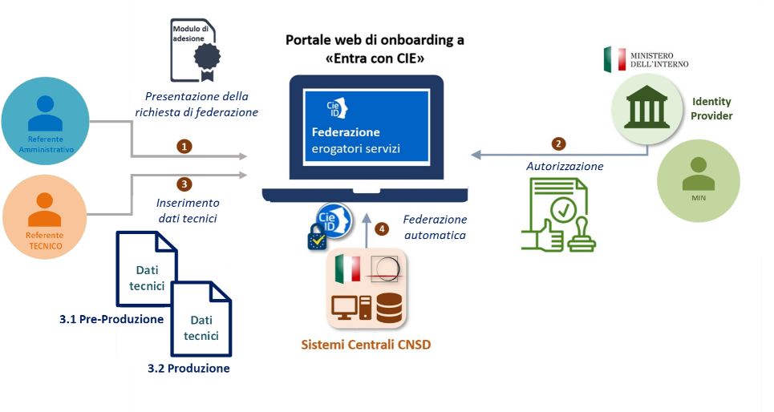

    Processo di federazione allo schema “Entra con CIE” 

L’organizzazione che intende aderire allo schema di identificazione
«Entra con CIE», nella figura di un Referente amministrativo designato a
svolgere tale attività, accede al portale con la propria identità
digitale, compila i principali dati amministrativi relativi al soggetto
(pubblico o privato) che richiede l’adesione allo schema «Entra con CIE»
e identifica un Referente tecnico che può essere interno al Service
Provider o esterno (partner tecnologico).

Il Referente tecnico ha in carico le attività tecniche di federazione,
integrazione dello schema all’interno dei servizi online del Service
Provider e messa in esercizio finale.

Il flusso di onboarding prevede, nello specifico, i seguenti passi
operativi:

1. Il Referente amministrativo accede al portale con la propria identità
   digitale e:

   -  inserisce i dati richiesti seguendo la procedura guidata

   -  scarica il modulo riepilogativo con i dati precedentemente
      inseriti che deve essere firmato digitalmente dal “Soggetto con
      poteri di firma”

   -  invia la richiesta in approvazione solo a seguito del caricamento
      del modulo firmato digitalmente

2. L’IdP, raccolte tutte le evidenze procede alla valutazione della
   richiesta presentata e può approvare oppure rifiutare indicando la
   relativa motivazione. L’approvazione della fase amministrativa
   sancisce l’entrata formale dell’organizzazione nello schema “Entra
   con CIE”. In caso di rifiuto, l’organizzazione dovrà risottomettere
   nuova domanda che recepisce le osservazioni dell’IdP

3. Il Referente tecnico, solo a seguito della ricezione della notifica
   di approvazione della richiesta di adesione, accede al portale con la
   propria identità digitale e segue la procedura per inserire i dati
   tecnici [2]_ richiesti ed effettuare i test necessari sia in ambiente
   di pre-produzione che di produzione

4. Il portale avvio l’attività automatica di federazione e convalida le
   configurazioni tecniche precedentemente inserite

Presentazione della richiesta di federazione
--------------------------------------------

Il portale è raggiungibile all’indirizzo web
https://federazione.servizicie.interno.gov.it/.

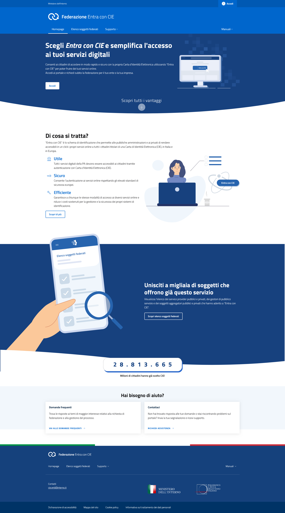

    Home page del portale di federazione Entra con CIE 

L’accesso al Portale può avvenire mediante identità digitale CIE o SPID
oppure, per gli utenti che ne sono già in possesso, tramite le
credenziali (username e password) fino alla data del 14/01/2024.

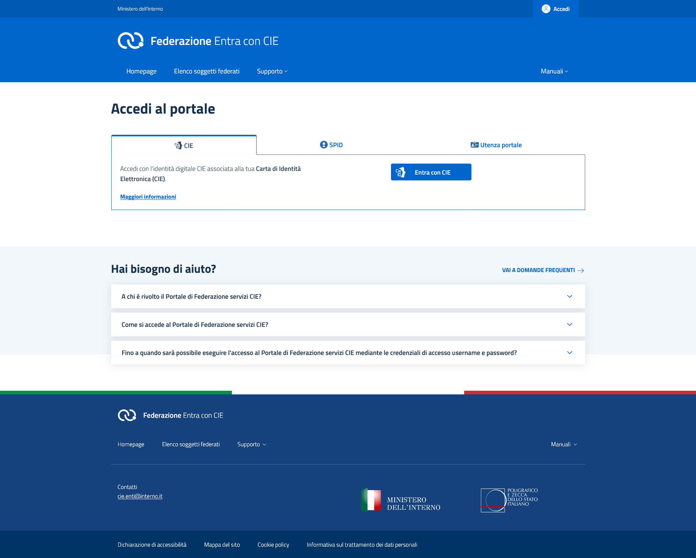

    Pagina di login 

A seguito dell’autenticazione, l’utente – in qualità di Referente
amministrativo dell’organizzazione - può inserire una pratica di
federazione.

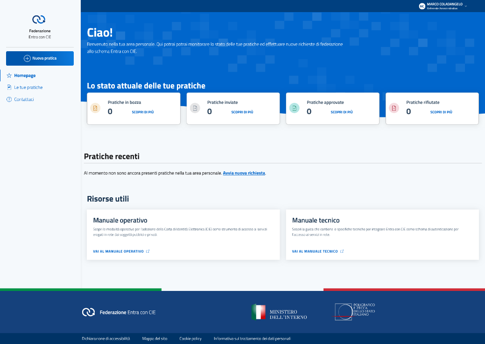

    Homepage account utente Referente amministrativo

Il Referente amministrativo specifica la natura giuridica del soggetto
per cui sta presentando la richiesta di federazione, “Soggetto pubblico”
oppure “Soggetto privato”. In funzione della natura, il Referente
amministrativo dovrà scegliere anche la finalità operativa (rif. *5*
*Modalità: il processo di onboarding*):

-  per i Soggetti pubblici: **Service provider** oppure **Soggetto
   aggregatore**

-  per i Soggetti privati: **Service provider** oppure **Soggetto
   aggregatore** oppure **Gestore di Servizio Pubblico**

Possono essere inserite più pratiche di federazione per la stessa
organizzazione ma devono necessariamente avere finalità operativa
differente (fornitore di servizi, soggetto aggregatore, gestore di
servizio pubblico).

Inoltre:

-  per i Soggetti pubblici è richiesto obbligatoriamente l’inserimento
   del codice IPA dell’ente e il codice AOO dell’Area Organizzativa
   Omogenea; i dati dell’ente saranno automaticamente recuperati dal
   servizio online *IndicePA*; **eventuali difformità dei dati (Codice
   AOO, indirizzo PEC, ecc.) dovranno essere sanate dall’Ente sul
   portale IPA**\  [3]_ **messo a disposizione da AgID**.
   
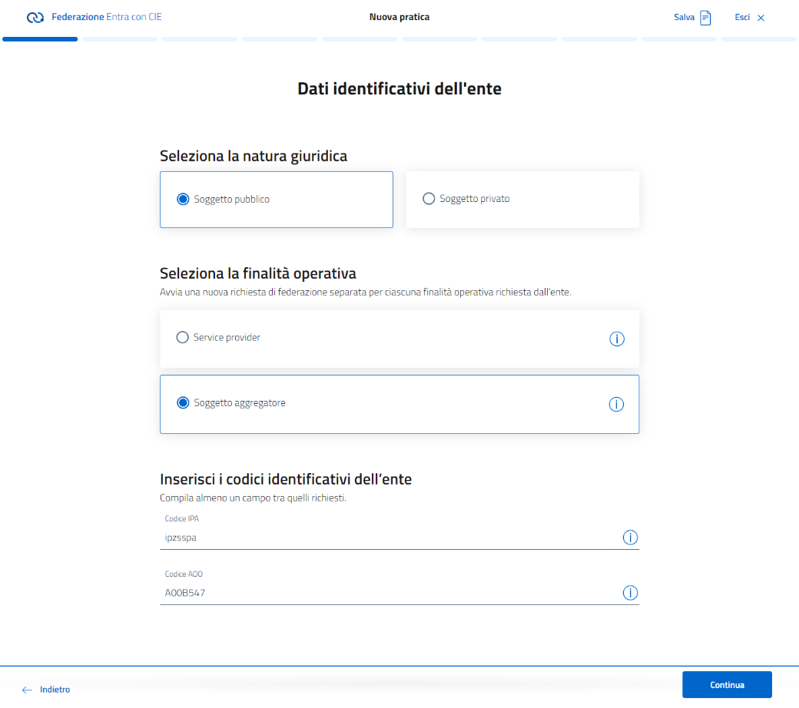

    Dati identificativi per un Soggetto pubblico

-  per i Soggetti privati è richiesto obbligatoriamente l’inserimento
   del numero di Partita IVA e, opzionalmente, del codice fiscale.
   
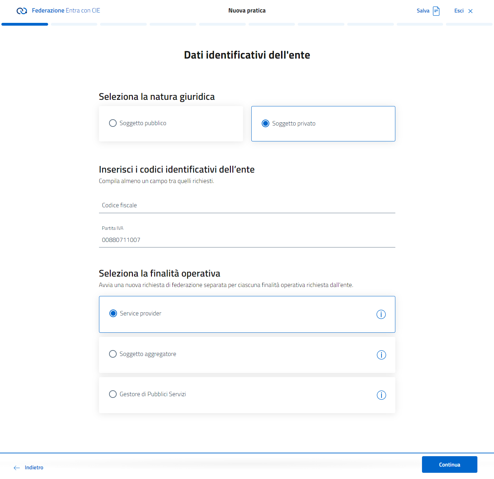

    Dati identificativi per un Soggetto privato

Per i Soggetti pubblici il sistema recupera automaticamente dal sistema
IPA (*Indice dei domicili digitali della Pubblica Amministrazione e dei
Gestori di Pubblici Servizi*):

-  denominazione dell’ente

-  denominazione AOO

-  indirizzo PEC

Il Referente amministrativo deve integrare manualmente le restanti
informazioni richieste.

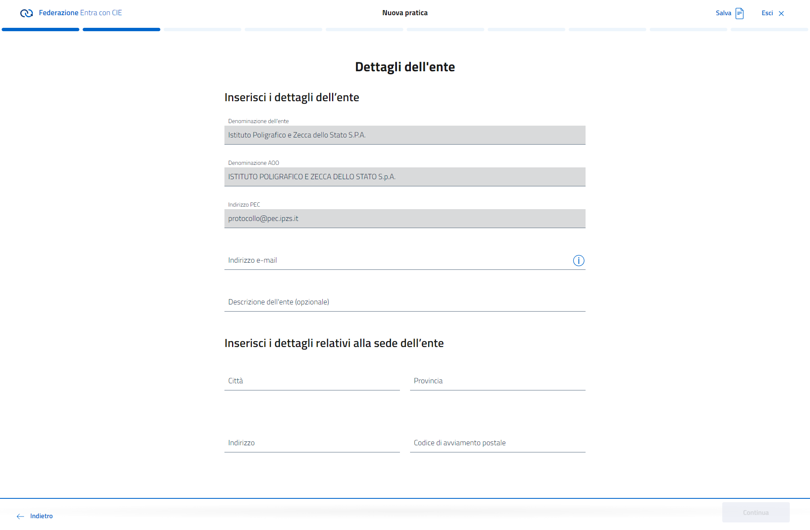

    Dettagli Soggetto pubblico

Per i Soggetti privati il Referente amministrativo deve specificare
manualmente tutte le info richieste e, in particolare:

-  denominazione dell’ente,

-  indirizzo PEC

-  indirizzo mail (diverso dalla PEC)

-  codice ATECO/NACE

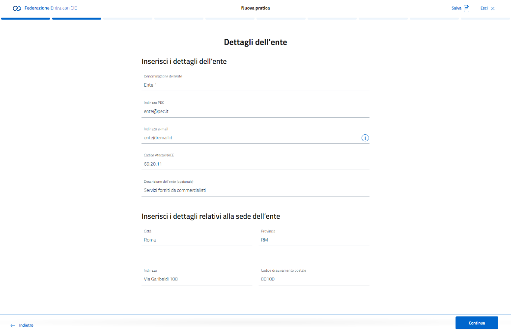

    Dettagli Soggetto privato

Il Referente amministrativo deve inserire obbligatoriamente i dati del
contatto interno all’ente per le eventuali comunicazioni di natura
tecnica (Contatto tecnico) e del soggetto dotato di poteri di firma per
il modulo di adesione. Se il richiedente è un soggetto privato, deve
caricare le dichiarazioni sostitutive di certificazione predisposte ai
sensi dell’art. 46 del DPR/445 2000 attestanti il possesso dei requisiti
di onorabilità.

Ai soli fini statistici, è richiesta l’indicazione del volume di accessi
giornalieri stimati per i propri servizi e, in caso di Soggetto
Aggregatore, la stima dei Soggetti Aggregati.

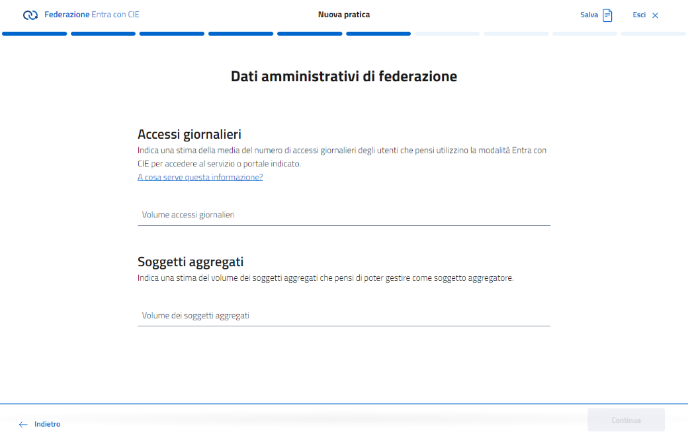

    Dati statistici

I dati del Referente tecnico (se diverso dal Referente amministrativo)
sono necessari per poter abilitare tale profilo alla gestione della
componente tecnica di federazione.

*Il Referente tecnico può essere inserito dal Referente amministrativo
sia in fase di creazione della pratica che successivamente
all’approvazione della stessa*.

L’ultimo step della fase di richiesta di adesione è la sottoscrizione
del Modulo di adesione – opportunamente firmato con firma digitale – ed
il relativo invio.

Il sistema genera automaticamente tale modulo con tutti i dati
precedentemente inseriti dal Referente amministrativo.

Il modulo deve essere scaricato, firmato digitalmente dal soggetto
aventi poteri e ricaricato sul portale. L’Organizzazione può allegare la
documentazione che attesti i poteri del soggetto firmatario del modulo.

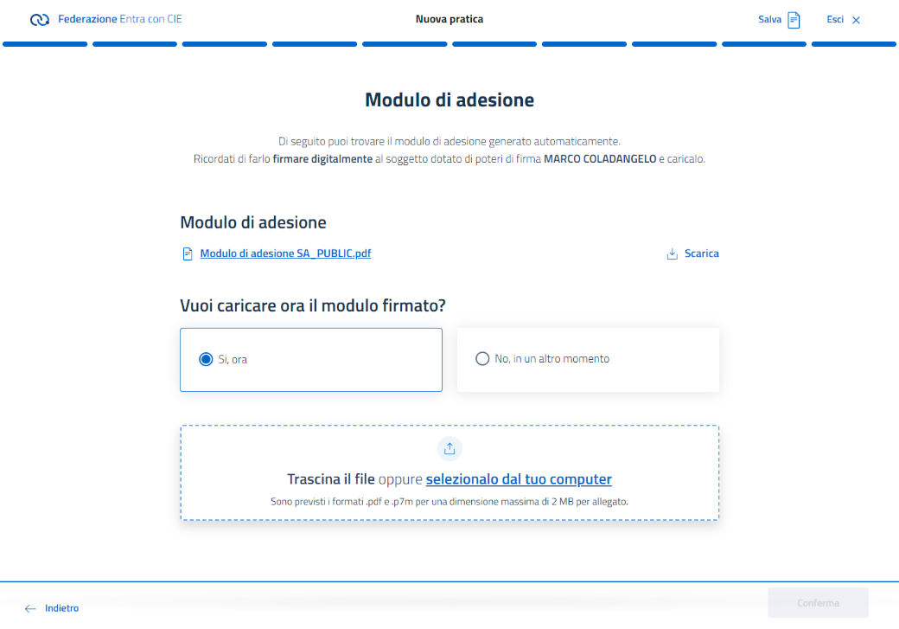

    Modulo di adesione

Alla sottomissione della richiesta di federazione il sistema provvede ad
inviare delle notifiche informative ai seguenti destinatari:

-  Referente amministrativo

-  Soggetto dotato dei poteri di firma

-  Ente

Autorizzazione alla federazione
-------------------------------

Il Ministero dell’Interno procede alla valutazione della pratica e può
decidere se approvarla (stato pratica APPROVATA) oppure rifiutarla
(stato pratica RESPINTA) indicando la relativa motivazione e/o richiesta
di integrazione di documentazione.

All’approvazione della richiesta di federazione il sistema provvede ad
inviare delle notifiche informative circa l’esito della valutazione ai
seguenti destinatari:

-  Referente amministrativo

-  Soggetto dotato dei poteri di firma

-  Ente

-  Destinatario del kit CIE di test (se richiesto)

L’organizzazione, in caso di rifiuto, dovrà risottomettere una nuova
richiesta.

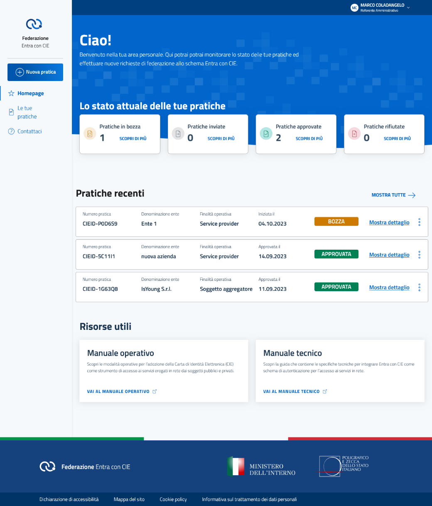

    Dashboard Referente amministrativo

Inserimento dei dati tecnici di federazione
-------------------------------------------

All’approvazione della richiesta di federazione da parte del Ministero
dell’Interno, il Referente amministrativo deve accedere al Portale e
abilitare – qualora sia stato già inserito – il Referente tecnico a
operare; in alternativa, se non è stato designato alcun Referente in
fase di presentazione della richiesta, può essere aggiunto mediante la
specifica funzionalità.

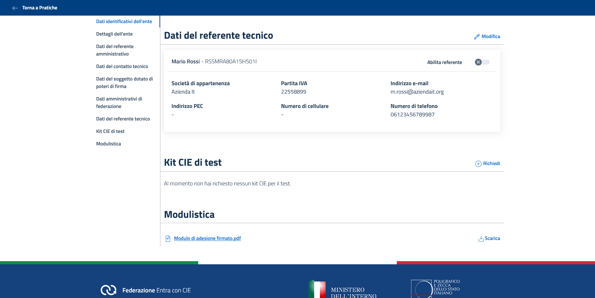

    Abilitazione Referente tecnico

Per consentire la federazione tra il soggetto e l’Identity Provider CIE
del Ministero dell’Interno, il Referente tecnico deve indicare le
componenti tecniche di pre-produzione e produzione per il protocollo
(SAML o OIDC) con cui si intende federare.

Accedendo al portale, il Referente tecnico seleziona il proprio profilo
di utenza con cui operare:

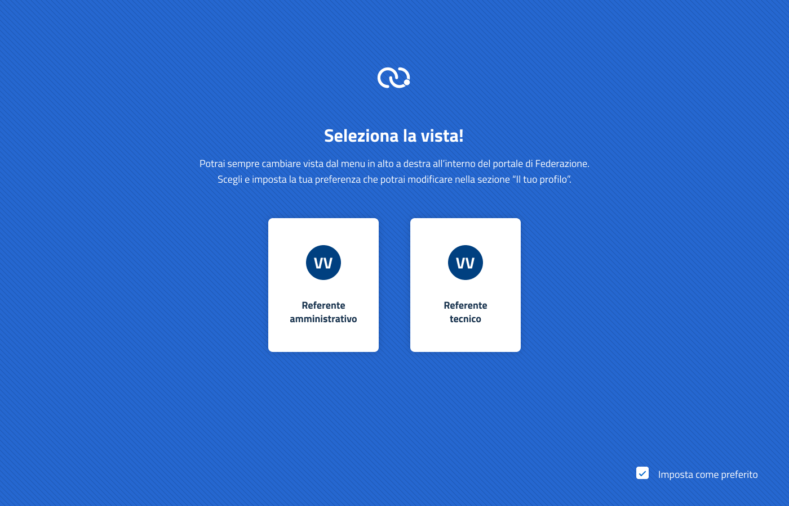

    Selezione vista Referente tecnico
	
L’utente può effettuare il cambio profilo tramite la voce di menu
dedicata:

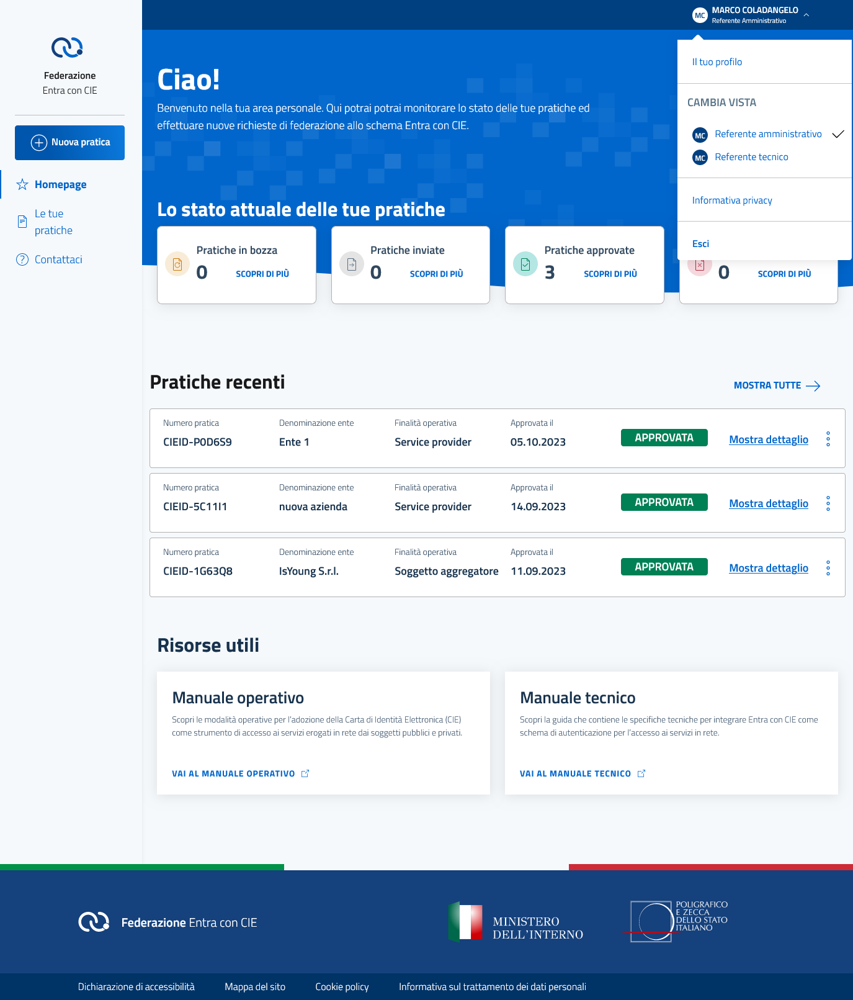

    Cambio profilo

Per avviare la fase di federazione di una componente tecnica, il
Referente tecnico accede al dettaglio della specifica pratica
direttamente dalla homepage oppure dalla lista delle pratiche per cui è
abilitato ad operare:

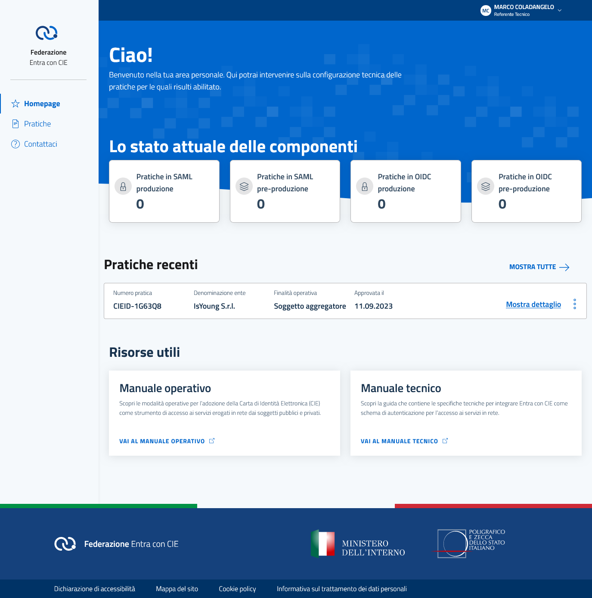

    Dashboard Referente tecnico

All’interno della pagina di dettaglio della pratica il Referente tecnico
visualizza l’elenco delle eventuali componenti tecniche già federate ed
ha la possibilità di creare una nuova componente tramite la funzionalità
dedicata.

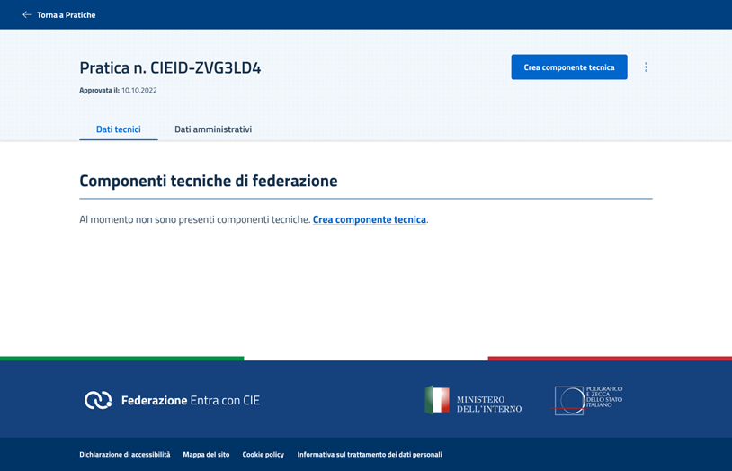

    Dettaglio pratica
	
L’operazione di creazione di una componente tecnica consta dei seguenti
passaggi:

1. Selezione del protocollo di federazione (SAML o OIDC):

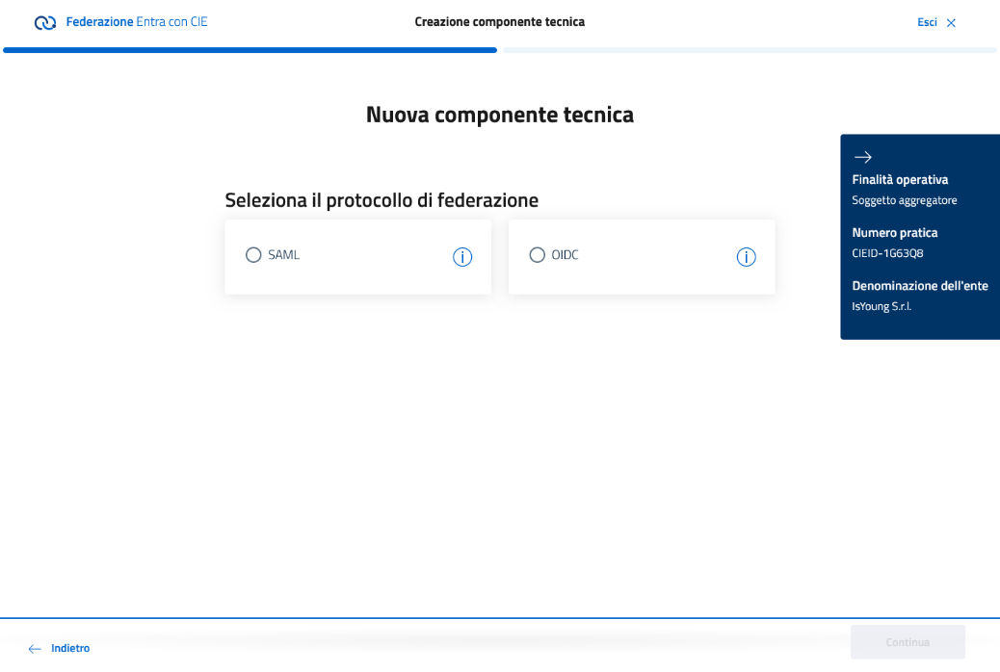

    Scelta del protocollo di federazione

2. Selezione dell’ambiente di federazione dove si vuole operare
   (pre-produzione o produzione):
   

    Scelta dell'ambiente di federazione

3. Inserimento dei dati tecnici relativi allo specifico protocollo
   selezionato:
   
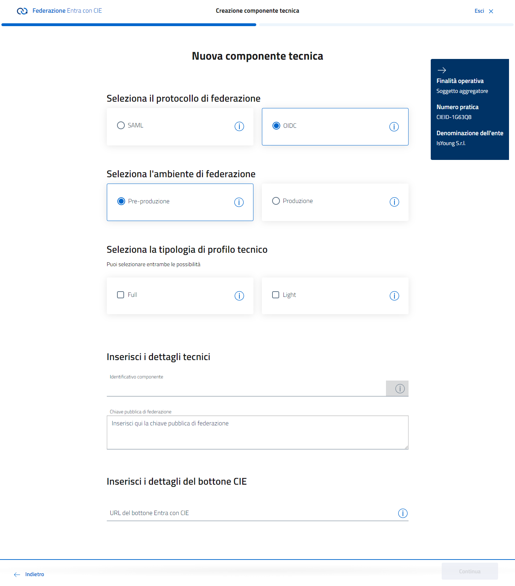

    Inserimento dettagli tecnici

Una volta completata la creazione della componente tecnica, il sistema
prende in carico la lavorazione della richiesta e procede alle verifiche
dei dati tecnici inseriti.

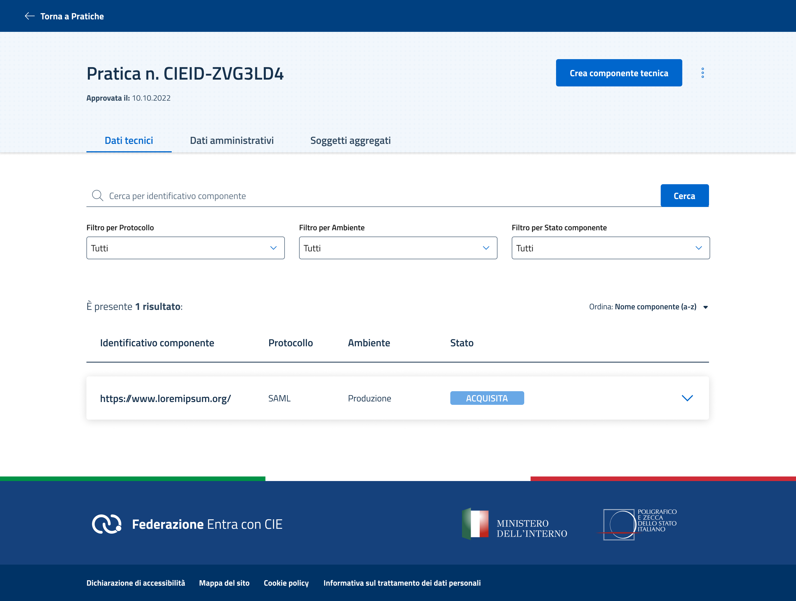

    Acquisizione componente tecnica

Federazione allo schema “Entra con CIE”
---------------------------------------

Se tutte le verifiche e configurazioni della componente tecnica
restituiscono esito positivo, il sistema effettua la federazione
nell’ambiente specificato e notifica l’esito ai seguenti destinatari:

-  Referente amministrativo

-  Referente tecnico

-  Ente

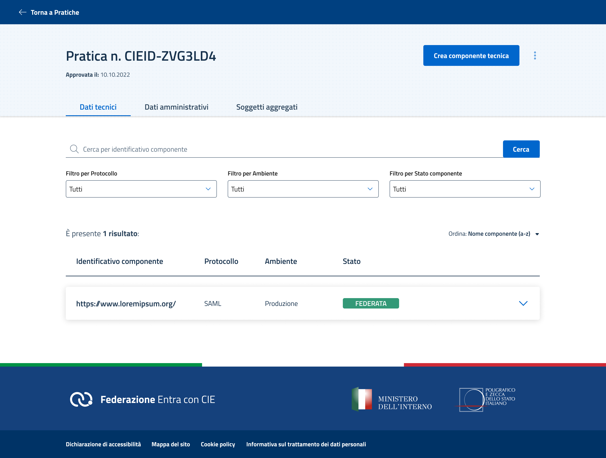

    Federazione della componente tecnica
	
Il Referente tecnico può procedere con le successive fasi di
integrazione e test dello schema di identificazione “Entra con CIE” con
la componente appena federata.

.. [1] 
   https://federazione.servizicie.interno.gov.it/
   
.. [2]
   I dettagli tecnici dell’iter di accreditamento sono
   disponibili all’interno del `Manuale tecnico per i fornitori
   di <https://docs.italia.it/italia/cie/cie-manuale-tecnico-docs>`__
   `servizi pubblici e
   privati <https://docs.italia.it/italia/cie/cie-manuale-tecnico-docs>`__
  
.. [3]
    https://www.indicepa.gov.it/ipa-portale/servizi-enti
