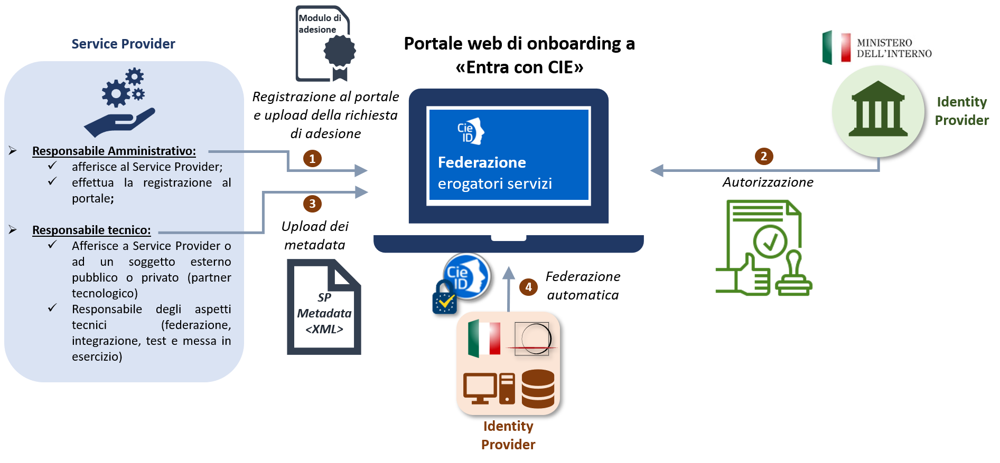
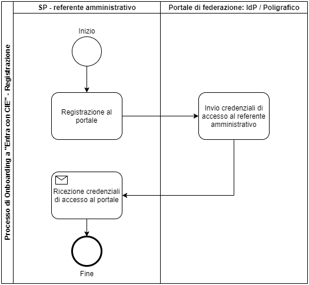
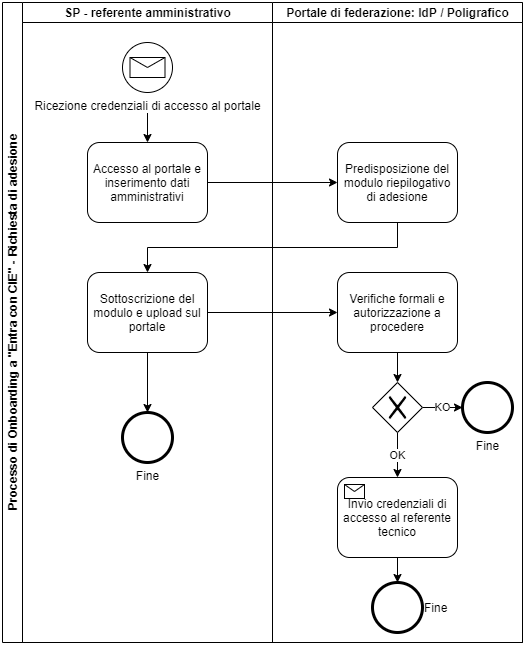
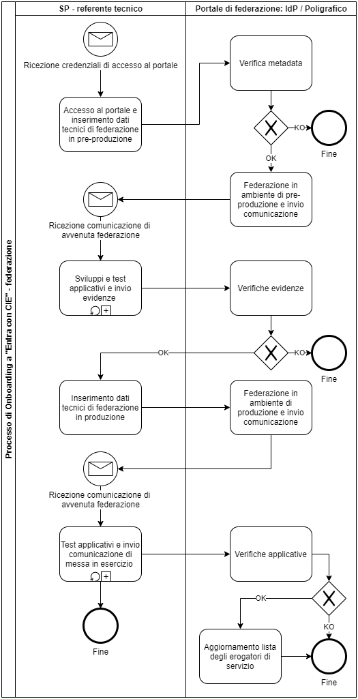

.. _onboarding:

=========================
Il processo di onboarding
=========================

La fase di onboarding costituisce il prerequisito fondamentale per il processo di integrazione dello schema di autenticazione "Entra con CIE". Tale fase è eseguita mediante il `portale di federazione erogatori di sevizi <https://www.federazione.servizicie.interno.gov.it>`__, messo a disposizione dall'Identity Provider e gestito e sviluppato dal Poligrafico che, in qualità di partner tecnologico del Ministero dell'Interno, ne cura tutti gli aspetti tecnici. 
In particolare il `portale di federazione erogatori di sevizi <https://www.federazione.servizicie.interno.gov.it>`__ consente al Service Provider di:

   - registrarsi ed effettuare facilmente la richiesta di adesione 
   - federare i metadata e ricevere immediatamente l’esito della federazione
   - verificare in ogni istante lo stato delle attività

I principali vantaggi che derivano dall'utilizzo del portale di federazione sono: 

   - gestione e controllo dell’intero ciclo di vita: federazione, sviluppo, test, produzione, esercizio e conduzione operativa;
   - snellimento delle procedure amministrative e tecniche di onboarding;
   - processo di federazione e configurazione automatizzato e più efficiente. 

Il processo di onboarding puó essere suddiviso in quattro sottofasi distinte:

1. Registrazione al portale e richiesta formale di adesione;

2. Autorizzazione alla federazione

3. Inserimento dei dati tecnici di federazione;

4. Federazione.

   Processo di onboarding Entra con CIE.

.. note::

   È importante notare che la registrazione al portale e l'invio della richiesta formale di adesione **deve** essere effettuata da un referente amministrativo che afferisce direttamente al Service Provider. Quest'ultimo, infatti, in qualità di responsabile dei servizi online erogati agli utenti finali, nelle vesti di un legale rappresentante, sottoscrive l'apposita richiesta di adesione e i relativi oneri derivanti l'utilizzo dello schema "Entra con CIE" per l'accesso ai propri servizi online. 

Il Service Provider, nella figura di un referente amministrativo designato a svolgere tale attività, effettua la registrazione al portale, compila i principali dati amministrativi relativi al soggetto (pubblico o privato) che richiede l'adesione allo schema "Entra con CIE" e identifica un referente tecnico che può essere interno al Service Provider o esterno (partner tecnilogico). Il referente tecnico ha in carico le attività tecniche di federazione, intergrazione dello schema all'interno dei servizi online del Service Provider e messa in esercizio finale. Rappresenta, inoltre, l'unica interfaccia tecnica con l'Identity Provider per eventuali comunicazioni di natura tecnica e/o attività di supporto per la risoluzioni di eventuali problemi in fase di integrazione. Il flusso di onboarding prevede, nello specifico, i seguenti passi operativi:

   1. Il referente amministrativo, conclusa con successo la fase di registrazione al portale, riceve le credenziali per l'accesso al portale
   2. Il referente amministrativo accede al portale e inserisce i dati amministrativi e relativi al referente tecnico designato;
   3. L'IdP, raccolte tutte le evidenze e, effettuate le virifiche previste dal processo di onboarding, fornisce l'autorizzazione formale a procedere con la federazione e invia al referente tecnico individuato dal SP le credenziali di accesso al portale
   4. Il referente tecnico accede al portale e compila i dati tecnici necessari per la federazione (ad es. carica i metadata di pre-produzione)
   5. Il Poligrafico, nel ruolo di partner tecnologico del Ministero dell'Interno, effettua la federazione nell'ambiente di pre-produzione dell'IdP 
   6. Il SP o eventualmente il partner tecnologico effettua le attività di sviluppo e test per consentire l'integrazione dello schema "Entra con CIE" per l'accesso ai servizi online del SP;
   7. Concluse le attività di integrazione, il referente tecnico raccoglie le evidenze di corretta implementazione in formato immagine (screenshot) e li carica all'interno del portale di federazione per consentire le opportune verifiche da parte dell'IdP;
   8. Conlcuse le verifiche applicative, il referente tecnico inserisce nel portale i metadata di produzione.
   9. Effettuati gli ultimi test in ambiente di produzione, il referente tecnico comunica, tramite apposita funzionalità esposta dal portale di federazione, la pubblicazione e la messa in esercizio finale del servizio.
   10. L'IdP, avvalendosi del Poligrafico, effettua le verifiche applicative di corretto funzionamento dello schema di identificazione e provvede ad aggiornare l'elenco degli erogatori di servizi abilitati che hanno concluso con successo l'iter di accreditamento allo schema "Entra con CIE".

Nei successivi paragrafi vengono descritti i principali processi di business previsti per completare l'onboarding allo schema "Entra con CIE".

.. note::

   I dettagli tecnici dell'iter di accreditamento sono disponibili all'interno del `Manuale tecnico per i fornitori di servizi pubblici e privati <https://docs.italia.it/italia/cie/cie-manuale-tecnico-docs>`__

Registrazione al portale e richiesta formale di adesione
========================================================

Il processo di onboarding viene avviato tramite la procedura di registrazione al portale che **deve** essere effettuata da un referente amministrativo del Service Provider. 

   Processo di registrazione al portale di federazione.

Ricevute le credenziali di accesso, il referente amministrativo può quindi accedere al portale per effettuare la richiesta formale di adesione allo schema "Entra con CIE". Questa costituisce il primo step formale e propedeutico al proseguo delle attivitá di federazione. In fase di richiesta di adesione, il referente amministrativo del Service Provider deve inserire le principali informazioni relative a:

   - l'Ente pubblico/soggetto privato che richiede l'integrazione di "Entra con CIE" per l'accesso ai propri servizi online;
   - l'eventuale partner tecnologico che svolge le attività tecniche di federazione, sviluppo applicativo e messa in esercizio finale per conto del Service Provider.
   - un contatto del referente amministrativo 
   - un contatto del referente tecnico afferente al Service Povider o ad un soggetto esterno (partner tecnologico)
   - una lista dei servizi online per i quali si richiede l'accesso tramite lo schema "Entra con CIE"
   - l'eventuale richiesta di CIE di test per agevolare le attivitá tecniche di sviluppo e integrazione

.. note::

   Qualora siano già disponibili le informazioni tecniche di federazione, il referente amministrativo può inserirle già in fase di richiesta. Alternativamente, può delegare il referente tecnico alla compilazione dei dati tecnici di federazione. 
   Il Service Provider, al fine di espletare le attività tecniche di federazione, ha facoltà di individuare un soggetto esterno pubblico o privato (partner tecnologico). A tal proposito, il Service Provider può indicare come referente tecnico una persona fisica che afferisce alternativamente:

      - al Service Provider (eventualmente può essere indicato lo stesso referente amministrativo);
      - al partner tecnologico (in presenza di più partner tecnologico per uno stesso Service Provider è obbligatorio indicarne uno solo fra essi che svolgerà il ruolo di interfaccia tecnica con l'IdP)

Al termine dell'inserimento dei suddetti dati, questi ultimi vengono presentati al referente amministrativo in un modulo riepilogativo disponibile per il download. Il modulo in formato *pdf*, opportunamente compilato e sottoscritto dal legale rappresentante del Service Provider, deve essere caricato nel portale per consentire all'IdP di effettuare le opportune verifiche volte all'autorizzazione formale alla federazione. Concluso con successo l'iter autorizzativo, vengono inviate le credenziali di accesso al portale direttamente al referente tecnico indicato in fase di richiesta di adesione.

   Processo di richiesta formale di adesione.

Ogni modifica dei dati contenuti e sottoscritti nel suddetto modulo di adesione richiede una nuova sottomissione dello stesso. In ogni caso, la richiesta di adesione ha una durata quinquennale terminata la quale é necessario effettuare nuovamente l'onboarding con il Ministero dell'Interno. 
Il Service Provider può modificare i riferimenti amministrativo e/o tecnico inviando una richiesta tramite PEC all’indirizzo cie.enti@interno.it.

.. note::
   La sottoscrizione del modulo di adesione obbliga i Service Provider ad ottemperare alle condizioni generali in materia di privacy, trattamento dati e conduzione operativa. La violazione delle suddette condizioni costituisce motivo di revoca immediata dell'abilitazione al sistema di autenticazione "Entra con CIE".   

Federazione
===========

Ricevute le credenziali di accesso, il referente tecnico, accedendo direttamente al portale, può effettuare autonomamente la richiesta di federazione. Quest'ultima consiste nello scambio dei metadati tra l'Identity Provider (Ministero dell'Interno) e il Service Provider che integra l'accesso mediante la CIE. 

.. note:

   Le modalitá operative di creazione dei metadata, nonché le specifiche tecniche dei protocolli di comunicazione tra il Service Provider e l'Identity Provider sono descritti nel `Manuale tecnico per i fornitori di servizi pubblici e privati <https://docs.italia.it/italia/cie/cie-manuale-tecnico-docs>`__

   Processo di richiesta di federazione.

Il referente tecnico, in fase di richiesta di federazione deve inserire i dati tecnici relativi alla federazione in ambiente di pre-produzione e produzione. In particolare, oltre alle URI dei servizi online per i quali si richiede l'utilizzo dello schema "Entra con CIE", il referente tecnico deve effettuare l'upload del file dei metadata di pre-produzione al termine del quale, viene effettuata una verifica formale sulla correttezza dello stesso. Ad esito positivo, viene inviata relativa comunicazione al referente tecnico, il quale può, dunque, procedere con la fase di sviluppo, integrazione e test. Al termine di tale fase, il referente tecnico deve caricare sul portale le evidenze di corretta implementazione al fine di consentire all'IdP di effettuare le opportune verifiche propedeutiche alla federazione in produzione (per i dettagli tecnici cfr. il `Manuale tecnico per i fornitori di servizi pubblici e privati <https://docs.italia.it/italia/cie/cie-manuale-tecnico-docs>`__). A fronte di un esito positivo delle suddette verifiche, il refente tecnico può effettuare l'upload del file di metadata di produzione per le verifiche formali di federazione. Infine, ultimati i test in ambiente di produzione, il refente tecnico, tramite il portale, comunica all'IdP la pubblicazione dei servizi online che consentono l'accesso tramite lo schema "Entra con CIE". 

